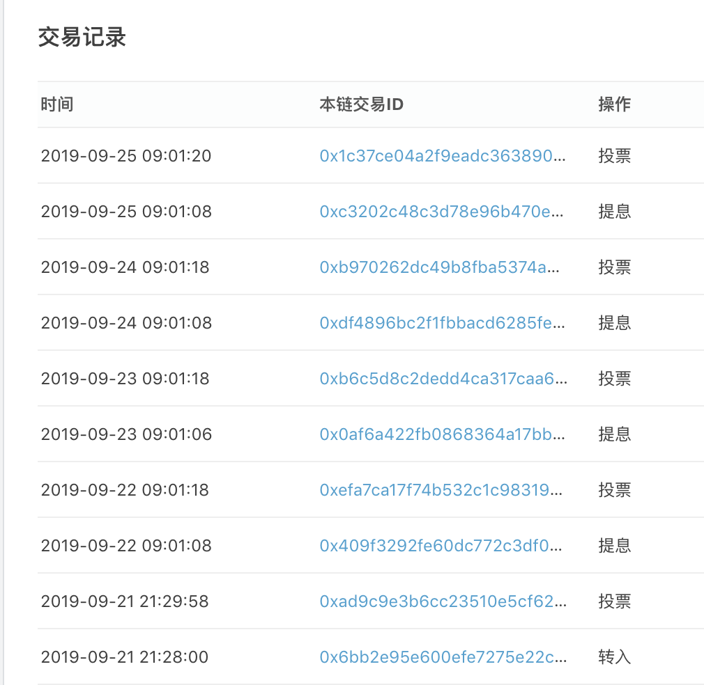

# PCX 自动提息复投操作脚本

1. 适当编辑代码
```js
const _ = require('lodash')
const { ApiBase, WsProvider } = require('chainx.js')

const pk = '' // 私钥
const address = '' // 自己的账户地址
const voteAddress = '' // 投票地址

async function sleep (delay) {
  return new Promise((resolve) => {
    setTimeout(() => {
      resolve()
    }, delay)
  })
}

;(async () => {
  try {
    const api = new ApiBase(new WsProvider('wss://w1.chainx.org.cn/ws'))
    await api.isReady

    // 提息操作
    const claim = api.tx.xStaking.claim(voteAddress)
    await claim.signAndSend(pk)
    // 等待 10秒 避免节点间的数据差异问题
    await sleep(10000)

    // 投票操作
    const assets = await api.rpc.chainx.getAssetsByAccount(address, 0, 10)
    const pcx = _.find(assets.data, ['name', 'PCX'])
    const free = pcx.details.Free
    // 保留 0.1 PCX 备用
    const amout = free - 1e7
    if (amout > 0) {
      const nominate = api.tx.xStaking.nominate(voteAddress, amout, '')
      await nominate.signAndSend(pk)
    }
  } catch (e) {
    console.log(e)
  }
  process.exit()
})()

```
2. 把编辑好的脚本加入定时器 crontab 示例 每天早上9 点 01 分自动操作

   ```bash
   1 9 * * * cd /root/revote && /root/.nvm/versions/node/v12.10.0/bin/node app.js >> log
   ```

结果可在 交易记录里查看


